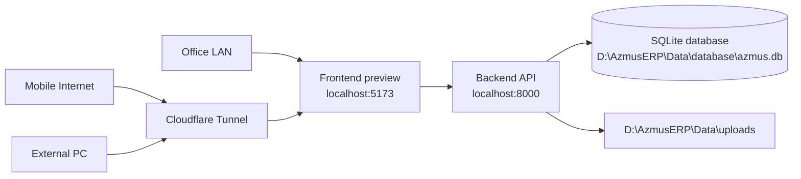

# Azmus ERP Remote Access

This setup keeps the production database on the local server PC:

```text
D:\AzmusERP\Data\database\azmus.db
```

No data is migrated to Render, Vercel, Cloudflare, or Tailscale. The backend runs on the server PC and remote users reach it through a tunnel.

## Architecture



Preferred public URLs:

| Service | URL |
|---------|-----|
| ERP UI | `https://erp.YOUR_DOMAIN.com` |
| ERP API | `https://api-erp.YOUR_DOMAIN.com` |

Replace `YOUR_DOMAIN.com` with your Cloudflare-managed domain. If you do not have a domain, use the Tailscale Funnel fallback below.

## Prerequisites

1. Server PC has Azmus ERP installed at `D:\AzmusERP\Application` or this repo path.
2. Backend `.env` keeps:

```env
DATA_ROOT=D:\AzmusERP\Data
DB_PATH=D:\AzmusERP\Data\database\azmus.db
UPLOAD_PATH=D:\AzmusERP\Data\uploads
BACKUP_PATH=D:\AzmusERP\Data\backups
LOG_PATH=D:\AzmusERP\Data\logs
MIGRATION_BACKUP_PATH=D:\AzmusERP\Data\migrations
DATABASE_GUARD=true
SKIP_DEMO_SEED=true
```

3. Install dependencies once:

```powershell
cd D:\AzmusERP\Application\backend
pip install -r requirements.txt

cd D:\AzmusERP\Application\frontend
npm install
```

## Preferred: Cloudflare Tunnel

1. Install `cloudflared` on the server PC:
   <https://developers.cloudflare.com/cloudflare-one/connections/connect-networks/downloads/>

2. Login:

```powershell
cloudflared tunnel login
```

3. Create the tunnel:

```powershell
cloudflared tunnel create azmus-erp
```

4. Copy `cloudflared-config.example.yml` to:

```text
C:\Users\<YOUR_USER>\.cloudflared\config.yml
```

5. Edit the copied config:

```yaml
tunnel: <TUNNEL_ID_FROM_CLOUDFLARE>
credentials-file: C:\Users\<YOUR_USER>\.cloudflared\<TUNNEL_ID_FROM_CLOUDFLARE>.json
```

6. Create DNS routes:

```powershell
cloudflared tunnel route dns azmus-erp erp.YOUR_DOMAIN.com
cloudflared tunnel route dns azmus-erp api-erp.YOUR_DOMAIN.com
```

7. Build frontend for the tunneled local API:

```powershell
.\deploy\AzmusERP-Production\scripts\build_remote_frontend.ps1 -ApiUrl "https://api-erp.YOUR_DOMAIN.com"
```

8. Start ERP + tunnel:

```bat
deploy\AzmusERP-Production\scripts\start_remote_access.bat
```

9. Public URL:

```text
https://erp.YOUR_DOMAIN.com
```

## Alternative: Tailscale Funnel

Use this if you do not have a Cloudflare-managed domain.

1. Install Tailscale and log in on the server PC.
2. Enable Funnel in the Tailscale admin console.
3. Run:

```powershell
.\deploy\AzmusERP-Production\tailscale-funnel.example.ps1
```

Tailscale will print the public Funnel URL, usually:

```text
https://<machine-name>.<tailnet>.ts.net
```

For production use, Cloudflare Tunnel with your own domain is preferred because the frontend and API can use stable hostnames.

## Automatic Startup

Run PowerShell as Administrator:

```powershell
.\deploy\AzmusERP-Production\scripts\install_remote_startup_task.ps1
```

This creates a Windows Scheduled Task named `AzmusERPRemoteAccess` that starts ERP and the tunnel at boot.

## Verification

Run:

```powershell
.\deploy\AzmusERP-Production\scripts\verify_remote_access.ps1 `
  -PublicUiUrl "https://erp.YOUR_DOMAIN.com" `
  -PublicApiUrl "https://api-erp.YOUR_DOMAIN.com"
```

Verify from:

| Location | Check |
|----------|-------|
| Office LAN | Open `http://SERVER-LAN-IP:5173` |
| Mobile internet | Disable Wi-Fi, open `https://erp.YOUR_DOMAIN.com` |
| External PC | Open `https://erp.YOUR_DOMAIN.com` |

Expected API health:

```json
{
  "active_database_path": "D:\\AzmusERP\\Data\\database\\azmus.db",
  "orders_count": 3,
  "mes_jobs_count": 10,
  "database_guard_enabled": true
}
```

## Security Recommendations

- Keep Cloudflare Access enabled for `erp.YOUR_DOMAIN.com` and `api-erp.YOUR_DOMAIN.com`.
- Allow only company Google/Microsoft accounts or one-time PIN email auth.
- Do not expose port `8000` or `5173` directly on the router.
- Keep Windows Firewall open only for office LAN if LAN access is needed.
- Use a strong `JWT_SECRET_KEY`; do not keep `azmus2026` in production.
- Keep `DATABASE_GUARD=true` and `SKIP_DEMO_SEED=true`.
- Back up `D:\AzmusERP\Data` daily.
- Restrict server PC login to admins only.

